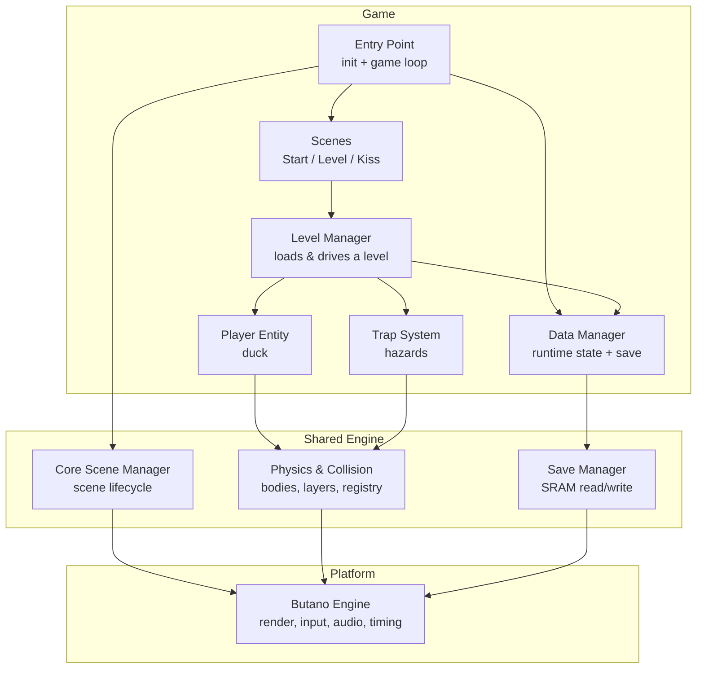
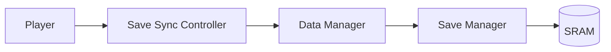

# Project Architecture

This page describes the **high-level structure** of the game: the main
subsystems, how they relate, how data moves between them, and the patterns the
codebase uses. It intentionally stays conceptual — no source code — so you can
form an accurate mental model before diving into any single component.

For definitions of capitalized terms, see the [Glossary](glossary.md).

## The big picture

The game is organized in layers, each with a single responsibility:



The **game** layer never talks to the hardware directly. It composes services
from the shared engine layer, which in turn wraps Butano. This keeps gameplay
logic independent of the platform and makes each piece testable and swappable in
concept.

## Main subsystems and their relationships

### Game loop management

The entry point does three things and nothing more:

1. **Initializes** the engine and sets global visual behavior (such as the fade
   color used during transitions).
2. **Creates long-lived objects** — the player entity, the data manager, and the
   level manager — and selects the first scene (the start screen).
3. **Runs the main loop**, which repeatedly lets the core scene manager update
   whichever scene is currently active.

A dedicated flag marks that the player finished the game. When it is set, the
loop swaps in the kiss (victory) scene, then clears the flag so the next scene
runs normally. Keeping the loop this thin means all behavior lives inside
scenes and managers, not at the top level.

> **Scene manager pattern.** Scenes are created, swapped, and torn down by a
> central manager. A scene that wants to change the screen simply asks the
> manager to set the *next scene*. The manager guarantees the current scene is
> released cleanly before the new one takes over — important on the GBA, where
> palettes and sprite slots are limited shared resources.

### Level management system

The **level manager** is the heart of gameplay. It owns everything that belongs
to the *current stage*:

- **Loading** a stage from its declarative data: the player's spawn point, the
  exit door, background, music, camera bounds, platforms, triggers, and traps.
- **Driving** one simulation step per frame (the level's `update`).
- **Reporting** what happened: keep running, the door was reached (advance), or
  the player returned to the title from the pause menu.
- **Unloading** the stage so its resources are freed before a transition.
- **Resetting** entities after death or a manual restart.

The level manager deliberately holds its collections in **fixed-capacity**
containers (platforms, triggers, traps). On a memory-constrained handheld, this
avoids heap fragmentation and keeps memory use predictable — see
[System Internals](system-internals.md).

A subtle but important design: a **generic reset list**. Rather than the level
manager looping specifically over traps to reset them, every entity that can be
reset registers itself through a shared *resettable* interface. The manager just
walks that list. New kinds of resettable objects can join later without the
manager changing.

### Player entity system

The **player** is the duck. It is not one monolithic class; it is *composed* of
focused parts:

- **Locomotion** — reads input and applies movement, acceleration, gravity, and
  jump behavior.
- **Animator** — chooses and advances the walk/jump/idle sprite frames.
- **State machine** — tracks the coarse movement state (idle / run / jump /
  fall) so other parts can react to it.
- **HUD** — owns the on-screen death counter and run timer.
- **Sprite** — the visible duck, registered with the engine's sprite system.

This composition keeps each concern small. The player also exposes gameplay
hooks the level manager uses: setting the spawn point, teleporting, toggling
visibility, and querying/updating the death count and timer. On death, the
player handles its own respawn logic and notifies the surrounding systems.

Movement is tuned for feel: acceleration ramps up to a max speed, gravity pulls
the duck down with a clamped fall speed, and jumps are made forgiving with
**coyote time** and **jump buffering** plus **variable jump height**. The
principles behind these are described in [Components — Player System](components.md).

### Trap system

**Traps** are the hazards. They share a **base trap** that provides collision
with the player, optional sprite animation, and sprite registration. On top of
that base sit specialized behaviors:

| Trap kind | Behavior | Typical use |
|-----------|----------|-------------|
| **Base** | Static, always dangerous. | Spikes, hazards sitting in gaps, disguised enemies. |
| **Moving** | Acceleration-driven once triggered. | Falling objects, rising hazards, charging traps. |
| **Path** | Interpolates along a defined route. | Patrols, figure-8 motion, floating enemies. |
| **Chase** | Trails the player, closing in as they advance. | Pressure hazards that punish standing still. |

Traps are built from **trap data** in the level definitions and are constructed
through a **trap factory**, so the level manager just hands over data and gets
the right kind of trap back. Each moving/path trap is linked to a **trigger**
that switches it on; chase traps watch the player directly.

A trap that the player touches kills the duck. The same collision machinery
that powers platforms and triggers powers traps — see below.

### Save / load system

Persistence is split across three cooperating pieces:



- **Game state** is a small, fixed-width record: current level, death count, and
  the run timer. Fixed-width fields keep the memory layout predictable on ARM.
- **Data manager** owns the runtime copy of the game state, the selected save
  slot (three slots), and the operations to load, save, and reset. It wraps a
  generic save manager that performs the actual SRAM reads/writes.
- **Save sync controller** owns the *policy* of when to write. SRAM writes are
  relatively expensive, so this piece watches the death counter and only commits
  when something meaningful changed (or when a caller explicitly forces a save,
  e.g. returning to the title). This keeps the gameplay systems from having to
  think about SRAM timing.

## Data flow between components

The dominant flow is a **per-frame update cascade**, driven from the main loop:

```mermaid
sequenceDiagram
    participant Loop as Main Loop
    participant SM as Scene Manager
    participant LS as Level Scene
    participant LM as Level Manager
    participant P as Player
    participant T as Traps
    participant SS as Save Sync

    Loop->>SM: update active scene
    SM->>LS: update()
    LS->>LM: update()
    LM->>P: update (input -> movement -> collision)
    LM->>T: update (activate, move, collide)
    LM->>SS: sync (persist if a death happened)
    LM-->>LS: result (None / LevelComplete / ReturnToTitle)
    LS->>SM: set_next_scene if advancing
```

Key points:

- **Input flows inward.** The player reads input and turns it into motion and
  collisions. The level manager reads the player's results (did it die? reach
  the door?).
- **Level data flows outward at load time.** When a stage loads, the level
  manager reads its declarative data once to build the running world (platforms,
  traps, triggers, spawn, door, music, background, camera).
- **Save data flows outward on change.** Deaths and the timer are mirrored into
  the runtime state and committed to SRAM only when the save-sync policy says
  so.
- **Scene transitions flow upward.** A scene tells the manager to change scenes;
  the manager handles the teardown/setup.

## Component interaction patterns

A few recurring patterns shape how pieces talk to each other:

- **Composition over inheritance.** The player is assembled from small
  collaborator objects (locomotion, animator, state machine, HUD). This keeps
  each part focused and independently understandable.
- **Shared base + specialization.** Traps share a common base for the concerns
  they all have (collision, animation, registration), while behavior differences
  live in subclasses chosen by a factory.
- **Interface-based reset.** Resettable entities (currently traps) opt into the
  death/restart flow through a shared interface, decoupling the level manager
  from concrete entity types.
- **Layered collision.** The engine's collision system uses **layers** (player,
  trap, platform, trigger, door). Each body declares which layers it belongs to
  and which layers it reacts to, so a trigger only notices the player, a trap
  only hurts the player, and a platform only blocks movement. This is why a
  trigger can be "invisible" — it has no visual, just a collision layer.
- **Reference injection with ownership clarity.** Long-lived objects (player,
  data manager) are passed by reference and live at static lifetime so they
  survive scene transitions. Short-lived, per-level objects are owned by the
  level manager and released on unload.
- **Data-driven configuration.** Stage contents come from immutable ROM-resident
  data, keeping design decisions out of code paths and making levels easy to add
  or tune — see [Level Design](level-design.md) and
  [Extensibility Guide](extensibility.md).

## Where the pieces live (conceptual map)

| Concern | Conceptual home |
|---------|-----------------|
| Engine init & game loop | Entry point |
| Scene switching | Core scene manager |
| Stage loading & stepping | Level manager |
| Duck movement & feel | Player (composed parts) |
| Hazards | Trap system + factory |
| Invisible event zones | Triggers |
| Stage completion | Door |
| Runtime state & slots | Data manager |
| When-to-save policy | Save sync controller |
| Menu & pause | Pause controller / Start scene |
| Viewport behavior | Camera (level-sized bounds) |
| Persistent storage | Save manager → SRAM |

## Related
- [Index](index.md)
- [Game Concepts](game-concepts.md)
- [Components](components.md)
- [System Internals](system-internals.md)
- [Glossary](glossary.md)"