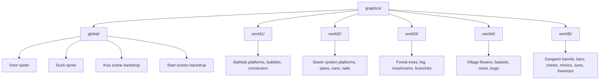
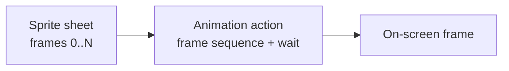
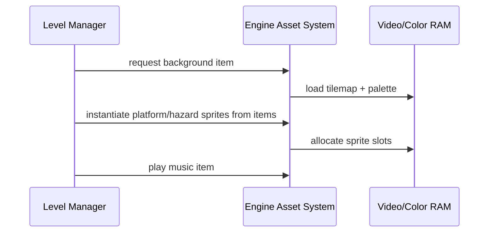

# Asset Management

This page describes how the game's art, sound, and animation are **organized,
processed, and used**. It focuses on the *concepts* and the *structure* of the
asset pipeline — not the build scripts. The build tooling (provided by the
engine) turns source assets into the forms the handheld understands; this page
explains how those source assets are laid out and how the game consumes them.

For how assets are referenced by stages, see [Level Design](level-design.md).

## Graphics asset organization

All graphics live under the game's graphics folder, split into a **global** set
shared across scenes and a set of **per-world** folders:

### Why split global vs. per-world?

- **Global assets** appear no matter which world you are in: the duck, the exit
door, the start screen, and the victory kiss backdrop. They are theme-agnostic.
- **Per-world folders** contain the platform tilesets and hazard art specific to
that world's theme. This keeps a world's visual identity self-contained and
makes it obvious which art belongs to which stage.

### The image + metadata pairing

Every graphics source comes as a **pair**:

| File kind | Role |
|-----------|------|
| **Image file** (`.bmp`) | The actual pixels — the sprite sheet or backdrop. |
| **Metadata file** (`.json`) | Describes how to interpret the image: dimensions, tiling, transparent color, and similar import hints. |

The build tooling reads the pair and produces the compact in-game representation
(a sprite item, a background item, a palette, etc.). Designers and artists edit
the image and its metadata; the game code never touches raw pixels — it refers
to the resulting *sprite item* or *background item* by name.

This pairing is the reason adding new art is a low-risk operation: drop a new
image + metadata pair into the right folder, and the build registers it.

## Audio asset structure

Audio is organized by role rather than by world:

| Folder / kind | Contents | Use |
|---------------|----------|-----|
| **Music tracks** (tracker modules) | One per world plus menu, start, and end themes. | Background music per stage/scene. |
| **Sound effects** (short samples) | Jump, footsteps, confirm/cancel, trap hit, trap fall, spikes, death. | Momentary playback on gameplay events. |
| **Legacy audio** | An older-format audio set kept for compatibility. | Optional / historical support. |

The music files are compact **tracker modules** — small pattern-based music that
the handheld audio hardware can play back efficiently, which is the traditional
approach for this class of device. Sound effects are short one-shot samples
triggered by gameplay events (a jump, a trap hit, a footstep while running).

A stage's music is chosen at load time from the level definition and plays for
the stage's duration. Sound effects layer on top, independent of the music.

## Animation systems

Animation is **frame-based** throughout the game. There is no skeletal or
procedural animation; instead, sprites cycle through frames from their sheet.

Three things define an animation:

1. **A frame sequence** — which frames from the sheet to show and in what order
   (e.g. frames 0→1→2 for a bubbling hazard, or a longer sequence for a mimic).
2. **A wait value** — how many frames to hold each animation frame before
   advancing (controls animation speed).
3. **A looping action** — the engine plays the sequence on a loop for the
   duration the entity exists.

Animation is used by:

- **The duck**, whose frames depend on its movement state and facing
  (walk-left, walk-right, jump, idle, back). The player's animator component
  selects the appropriate sequence based on the state machine.
- **The door**, which has its own looping animation.
- **Certain traps**, notably the animated mimic, which cycles frames to look
  alive even while staying motionless as a hazard.

An entity with an **empty** frame sequence simply displays a single static frame
— used by hazards that do not need to animate. This means "no animation" is a
deliberate, valid configuration rather than a special case.

## Asset loading process (conceptual)

Asset handling happens in two stages — **at build time** and **at scene load
time**.

### At build time

1. Source images and metadata are processed into compact sprite/background items
   and palettes.
2. Music and sound files are converted into the handheld's audio formats.
3. The results are compiled into the ROM. From the game's perspective, each
   asset becomes a named *item* it can reference.

### At scene / level load time

When a stage loads, the level manager takes the stage's chosen
**background item**, **music item**, and the sprite items named by its platforms
and traps, and instantiates the on-screen objects from them:

### At unload time

When leaving a stage, the manager releases the sprites and background it
created. This frees the **sprite slots** and **palette entries** so the next
stage can reuse them without contention. On a device with a hard ceiling on
visible sprites and colors, disciplined release is what allows many distinct
stages to coexist in one program.

> **Why this matters:** The handheld has a fixed number of sprite slots, tile
> spaces, and palette colors. The engine's asset items are templates; the
> on-screen instances are what actually consume those finite resources. Loading
> a stage and releasing it cleanly is how the game stays within those ceilings
> across a long play session.

## Organization by theme / level

The organizing principle is **theme cohesion**: everything a world shows comes
from that world's folder, and everything shared across worlds comes from the
global folder. When adding or editing content:

- **A new world** gets its own folder with platform tilesets, hazard sprites,
  and a backdrop, plus its own music track.
- **A hazard shared by several worlds** belongs in the global folder.
- **A one-off asset** still lives with its world's folder so it is easy to find
  and reason about.

This layout means a designer working on world 3 only needs to look in the forest
folder (plus global for shared pieces), and a contributor auditing memory use
can reason about how much art each world contributes.

## Naming conventions

Assets follow a descriptive, mostly dimension-aware naming style (e.g. a name
that hints at the object and, where relevant, its pixel size). Consistent naming
serves two purposes:

- **Discoverability** — a glance at the folder reveals what is available.
- **Stable references** — the game code and level data reference assets by the
  names the build derives from these files, so renaming an asset is a
  coordinated change.

When adding an asset, pick a name that fits the existing pattern for its world
and object type.

## Practical guidance

- **Edit the source pair, not the build output.** Changes go into the image +
  metadata; the build regenerates everything downstream.
- **Match the theme.** Hazard art should visually belong to its world.
- **Keep sprite sizes modest.** Larger sprites consume more slots and memory;
  size them to what the gameplay actually needs.
- **Reuse via global.** If an asset would appear in multiple worlds, put it in
  the global folder rather than duplicating it.
- **Test after adding art.** Because assets become named items at build time,
  a new asset is not usable by a stage until the build has registered it and
  the stage references it correctly.

See [Extensibility Guide](extensibility.md) for the steps to wire a new asset
into a stage.

## Related
- [Index](index.md)
- [Level Design](level-design.md)
- [Components](components.md)
- [System Internals](system-internals.md)
- [Extensibility Guide](extensibility.md)
- [Glossary](glossary.md)