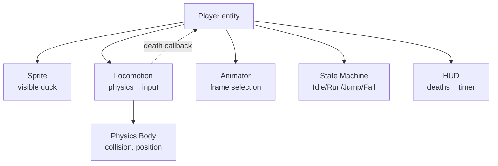
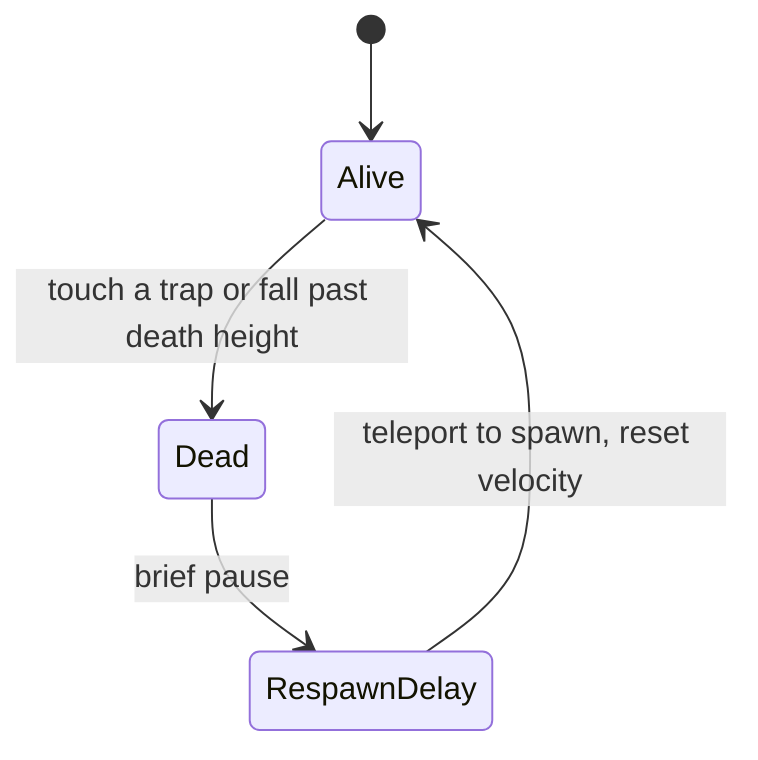
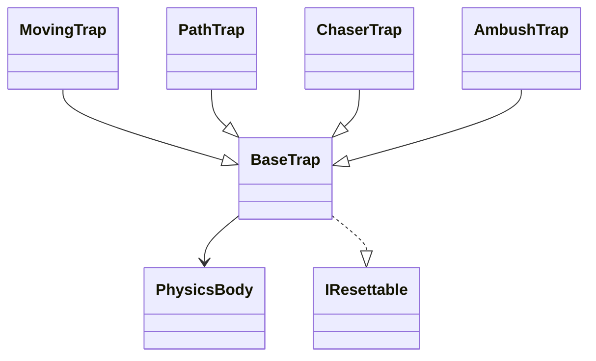
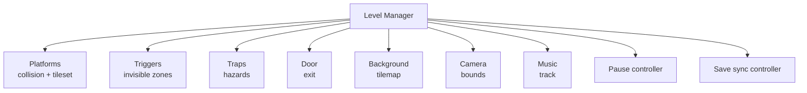
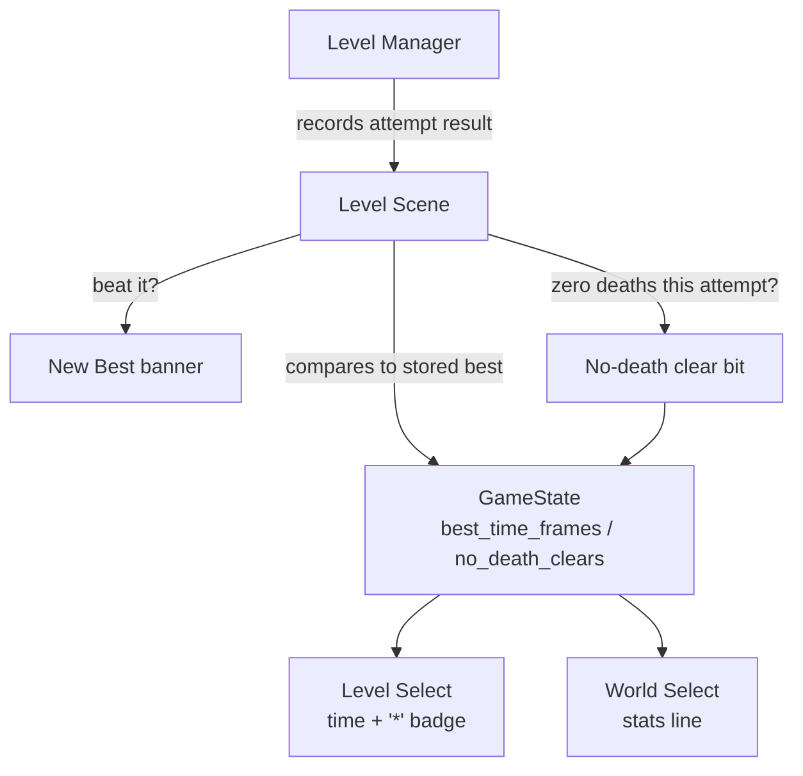

# Components

This page gives a **conceptual deep-dive** into the three largest gameplay
systems: the **Player System**, the **Trap System**, and **Level Management**,
plus the smaller **Audio System** and **Progress Feedback** systems built on
top of them. Each section describes responsibilities, states, and
interactions — not code.

For the high-level view of how these fit together, see
[Project Architecture](architecture.md).

---

## 5.1 Player System

The player is the duck. It is built by **composition**: a top-level entity that
owns several focused collaborators. Each collaborator has one job, which keeps
the system easy to reason about and extend.



### Player states & capabilities

The state machine tracks a small set of coarse movement states that the
animator and locomotion react to:

| State | Meaning | Typical animation |
|-------|---------|-------------------|
| **Idle** | Standing still, on the ground. | A static/idle frame (or facing-back when not moving). |
| **Run** | Moving horizontally on the ground. | Alternating left/right walk frames. |
| **Jump** | Rising after a jump. | Ascent frames matched to facing direction. |
| **Fall** | Descending (not jumping). | Descent frames matched to facing direction. |

The locomotion component also tracks a **facing** direction (forward, back,
left, right) that feeds the animator and lets the duck turn to look at the
camera when idle.

### Movement mechanics

Locomotion owns the per-frame physics step, performed in a deliberate order so
that collisions, ground detection, and death checks all happen consistently
within a single frame:

1. **Horizontal input** — accelerate left/right up to the max speed, applying
   the configured acceleration per frame.
2. **Jump handling** — including **coyote time** (a few grace frames after
   leaving a ledge) and **jump buffering** (a few frames before landing).
3. **Gravity** — applied every frame to build downward velocity.
4. **Variable jump** — releasing the jump button early shortens the ascent.
5. **Velocity clamping** — keeps the horizontal and fall speeds within the
   configured caps.
6. **Bounds** — the duck bounces off the world's left/right edges (the boundary
   is set per level by the level manager, based on the world width).
7. **Ground state update** — queries the collision system to determine whether
   the duck is currently resting on a platform.
8. **Death check** — if the duck falls below a configured death height, a death
   is raised.

The ground state and facing direction are then made available to the animator
and state machine so they can pick the correct frames for this tick.

### Jump physics principles

The jump is not a single impulse; it is a small set of cooperating rules that
together give the duck a responsive, controllable leap:

- The duck receives an upward velocity when a jump begins.
- The jump is **height-controllable**: holding the jump button extends the
  ascent, releasing early shortens it.
- **Gravity** constantly pulls the duck down, and a **max fall speed** keeps
  descents predictable.
- **Coyote time** and **jump buffering** forgive small input timing errors,
  which is essential for tight platform layouts to feel fair.

The exact tuning values (acceleration, max speed, jump speed, gravity, fall
speed clamp, coyote/buffer frames, death height) live in a central
configuration so designers can tune the feel in one place and have it propagate
to every stage.

### Death & respawn system

Death is simple and forgiving:



- A **trap collision** or **falling past the death height** triggers a death.
- The duck briefly pauses (so the player registers what happened), then
  teleports back to the stage's **spawn point** with velocity reset.
- The **death counter** increments, and the **save-sync** system persists the
  updated total.
- The level manager uses a **generic reset interface** to put every trap back to
  its starting state, so a respawn always faces the same hazard layout.
- Whether *any* death occurred during the current attempt is tracked
  separately from the running total, feeding the **no-death clear** record
  described under [Progress Feedback](#54-progress-feedback) below.

The locomotion component does **not** own respawn logic itself. Instead it
raises a death through a small **callback interface**, and the player entity
handles the rest — keeping locomotion focused purely on movement.

### HUD components

The player owns an HUD consisting of:

- **Death counter** — a numeric readout that increments on each respawn.
- **Run timer** — minutes, seconds, centiseconds, driven by a frame counter
  tuned for the handheld's refresh rate and avoiding expensive division.

The HUD exposes a **visibility toggle** so title screens and the kiss scene can
hide it without destroying it. Timer digits are only updated when their value
actually changes, to avoid redundant work each frame.

---

## 5.2 Trap System

Traps are the hazards the duck must avoid. They share a **base trap** for the
concerns every trap has and specialize in behavior through subclasses chosen by
a **trap factory** at level load.



### Base responsibilities

The base trap owns:

- A **collision volume** linked to a sprite, with a position, size, and offset.
- **Collision with the player** — when the duck enters the trap's collision
  area, the base trap kills the duck and plays the appropriate hit sound.
- **Optional sprite animation** — a looping animation action is attached when
  the level data specifies an animation frame sequence.
- **Sprite registration** with the engine's sprite system, so the trap's pixels
  are properly managed for the current scene.

### Trap categories & purposes

| Category | Activation | Movement | Design purpose |
|----------|-----------|----------|----------------|
| **Base** | Always active | None | Static obstacles that punish careless landing. |
| **Moving** | Trigger-linked | Acceleration-driven once triggered | Timed hazards released mid-run. |
| **Path** | Trigger-linked | Interpolates along defined waypoints | Patrols, sweeping hazards, figure-8 enemies. |
| **Chase** | Watches the player | Moves to close the gap when the player advances | Pressure hazard that punishes hesitation. |
| **Ambush** | Watches the player (proximity) | Lunges once in a fixed direction, then returns | Disguised hazards that punish getting too close. |

### Trap behaviors & characteristics

- **Base traps** stay exactly where they are placed. They can still animate
  their sprite (e.g. a mimic breathing) while remaining motionless as a hazard.
- **Moving traps** start dormant. When their linked **trigger** fires, the trap
  begins accelerating in a configured direction up to a maximum velocity. Once
  the duck respawns, the trap returns to its start position and re-arms.
- **Path traps** follow a route defined by waypoints relative to their origin.
  They interpolate smoothly between nodes, waiting a configured number of
  frames on each step. This creates patrols and other repeating trajectories.
- **Chase traps** bypass normal physics entirely. They watch the player's
  position and drift rightward to keep a configured distance behind them, but
  only up to a maximum speed. Because they only ever move right, they never
  retreat — the duck must keep moving forward to stay ahead.
- **Ambush traps** stay motionless (optionally animating, like a mimic) until
  the player comes within a configured horizontal range. They then lunge
  once in a fixed direction for a fixed duration, ease back to their start
  position, and re-arm. Like chase traps they read the player's position
  directly rather than reacting to a Trigger, but activation is
  proximity-based rather than continuous tracking, and movement is a single
  bounded lunge rather than an ongoing pursuit.

### Activation mechanisms

Two activation styles exist:

- **Trigger-linked activation.** Moving and path traps reference a trigger by
  its stable name. When the duck crosses into the trigger's invisible
  rectangle, the trigger flips "on" and every trap bound to that name begins
  its behavior.
**Direct player tracking.** Chase and ambush traps read the player's
  position every frame. Chase traps use it continuously to ease toward a
  following distance; ambush traps only use it to test a proximity
  threshold, then run a fixed, self-contained lunge sequence independent of
  further player movement.

### Trigger lookup

A trigger can optionally carry a stable name (`TriggerData::name`); a trap
binds to it via `TrapData::trigger_name`, resolved through
`LevelManager::get_trigger_by_name()`. This is the *only* binding mechanism
Moving/Path traps use - every one in every level sets `trigger_name`. Named
lookup is a simple linear scan over the level's triggers — with a per-level
cap of 16 and the lookup happening once per trap at level load (never per
frame), this costs nothing worth measuring.

An earlier version of `TrapData` also carried a raw `trigger_index` field for
binding by array position, kept for a time so no existing level literal
needed editing. It was never actually read (every level had already
migrated to named binding) and has since been removed from the struct - see
[Extensibility Guide](extensibility.md) for how to author a trigger today.
Because binding is by identity rather than position, one trigger can freely
activate several traps at once (a **trigger chain**): give each trap the
same `trigger_name` and they all fire together, as `level0_traps` in
`levels_world1.h` and several other levels already do.

### Interactions with the player

Traps and the player meet through the **collision layer system**. Traps belong
to a **trap layer** and the player subscribes to it; when the player's body
overlaps a trap, the trap's collision handler kills the player. This same
layered approach is what lets platforms block the player, triggers sense the
player without being touched back, and doors signal completion when entered —
all from the same underlying collision framework.

### Reset model

Every trap implements the shared **resettable** interface. On player death or a
manual restart, the level manager walks its resettable list and calls reset on
each. Traps return to their start positions, re-arm, and (for chase traps)
forget their tracking history. This keeps respawn deterministic: the same stage
layout faces the player each time.

### Hard Mode speed scaling

Moving, Chase, and Ambush traps read a **Hard Mode multiplier** from the level
manager at construction time (`LevelManager::hard_mode_multiplier()`), which
returns a configured scale factor when the loaded save slot has Hard Mode
enabled, or `1` otherwise. The multiplier is applied once, in the **trap
factory**, to the relevant velocity/speed parameters before the concrete trap
type is constructed - it is not re-applied per frame, and it never touches
the underlying level data itself. Path traps are deliberately excluded: their
pacing is authored as a waypoint-to-waypoint frame count rather than a
velocity, which would need separate handling to scale safely.

Because the scaling happens at construction, toggling Hard Mode takes effect
the next time a level loads (on Continue/Restart from the pause menu, or on
the next level transition) rather than retroactively on already-placed traps
mid-level. See [Game Concepts — Hard Mode](game-concepts.md#hard-mode) for the
player-facing unlock/toggle flow.

---

## 5.3 Level Management

The **level manager** is the stage's runtime container. It owns everything that
exists *during a stage* and nothing that persists across scenes.



### Resource management

The level manager holds its collections in **fixed-capacity** containers sized
to the maximum the game expects. This choice avoids heap fragmentation on a
device where memory is precious and long play sessions must remain stable. On
unload, every resource is explicitly released before the next stage loads, so
the next stage's assets can claim the same sprite slots and palettes without
contention.

Platform sprites are wrapped in the shared **Sprite** type and registered with
**SpriteRegistry** at load time — the same pattern used for the door and every
trap. This is what lets platforms scroll correctly with the camera on wide
levels; a raw sprite handle that bypasses this wrapper stays pinned to its
initial screen position regardless of camera movement.

### Level lifecycle

A stage goes through four phases:

1. **Load.** The manager receives the stage's declarative data and builds the
   runtime world: place the platform sprites and register their collision
   bodies; create the triggers; construct each trap through the factory
   (applying the Hard Mode multiplier where relevant - see
   [Trap System](#hard-mode-speed-scaling) above) and add it to both the trap
   list and the resettable list; place the door; set the music and
   background; configure the camera bounds and horizontal bounce boundary;
   set the player's spawn point; establish the save-sync baseline (including
   the no-death-clear baseline); reset the level's internal frame clock used
   for the best-time record.
2. **Run (per frame).** Each frame the manager updates the pause controller,
   the level clock, the player, the traps, the door, and the save-sync
   controller, then reports an outcome to the calling scene:
   - **None** — keep running (or paused).
   - **LevelComplete** — the door was reached; advance.
   - **ReturnToTitle** — the player chose "Title" from the pause menu.
3. **Reset (optional).** On player death or a manual restart, the manager walks
   its resettable list, restoring traps to their initial states. A death also
   disqualifies the current attempt from earning a no-death-clear badge (see
   [Progress Feedback](#54-progress-feedback) below).
4. **Unload.** When leaving the stage, the manager releases every resource —
   sprites, backgrounds, music — so the next scene starts with a clean pool.

### Scene transitions

The level manager does not directly switch scenes. It reports an outcome to the
level **scene**, and the scene asks the **core scene manager** to move to the
next scene. The scene manager guarantees the previous stage is torn down before
the next one initializes, which is critical on a device with limited shared
resources (palettes, sprite slots, VRAM).

### Level data organization

A stage is defined by immutable, ROM-resident data describing:

- The **platform list** — position, size, sprite, and tile index for each
  solid surface.
- The **trigger list** — invisible rectangles that activate hazards.
- The **trap list** — one entry per hazard with its type, sprite, animation,
  activation, and behavior-specific parameters.
- The **background** tilemap, the **music** track, the player's **spawn point**,
  and the **door** position.
- The **world dimensions** — a wider world enables real camera scrolling;
  screen-sized values keep the camera effectively fixed.

Keeping stage contents as static data means designers can add or tune stages
without touching engine or gameplay code paths — see
[Extensibility Guide](extensibility.md). Hard Mode deliberately sits outside
this list: it is a runtime multiplier applied at load time, not a property a
stage's data ever encodes, so no stage needs a "hard mode variant" authored.

### Camera systems

The camera is configured per stage from its world dimensions. When the world
matches the screen size, the camera is effectively static and the duck moves
within the visible area. When the world is wider, the camera follows the duck
and clamps to the world's edges. The same world-width value also sets the
duck's horizontal bounce boundary, so the duck never leaves the intended play
area.

---

## 5.4 Progress Feedback

Beyond the always-on HUD (death counter + timer), three smaller systems give
the player feedback about their progress against their own past runs. All
three read from fields already tracked in the per-slot save state - none
needed a new persistent counter of their own.



### New Best banner

When the door is reached, the level scene compares the just-finished
attempt's frame count against that level's stored `best_time_frames` entry.
If it's a new record (including the level's first-ever clear), the scene:

1. Updates the stored best time.
2. Holds the scene on a **"New Best!"** banner showing the new time
   (mm:ss.cc) and a "Press A to continue" prompt, instead of transitioning
   immediately.
3. Only proceeds to the next level (or the kiss scene, on the final level)
   once the player presses A or Start.

The level-clear logic itself (advancing `level`/`furthest_level`, persisting
deaths/timer) is unaffected by whether a banner shows - the banner only gates
the *scene transition*, not whether progress was recorded.

### No-death clears

Separately from the running death total, the save-sync controller tracks
whether the player's death count has changed since the level was loaded (or
since the last reset/restart). If the duck reaches the door with that count
unchanged - i.e. this specific attempt had zero deaths - the level scene sets
a bit for that level in a `no_death_clears` bitmask (one bit per level,
stored per save slot, same indexing as `best_time_frames`).

This is a "have I ever done this" record, not a per-attempt flag: once set
for a level, it stays set (it survives a full-game reset the same way
`best_time_frames` does) even if a later attempt on that level does involve a
death. Level Select reads the bit to append a trailing `*` to that level's
best-time readout once it's been set.

### World-select stats line

World Select's menu already lists each world with a locked/unlocked state
derived from `furthest_level`. Underneath that list, a single aggregate line
is computed straight from the loaded save slot's existing fields:

- **Deaths** — the slot's running total death count (not per-level).
- **Cleared** — how many levels have a non-zero `best_time_frames` entry
  (i.e. have been finished at least once), out of the total level count.

Nothing new is written to the save for this line; it's a read-time
aggregation over data the level-clear and death-tracking systems already
maintain, rebuilt whenever the menu is (re)built.

---

## 5.5 Audio System

Sound is split across two independent volume levels the player can tune from
the pause menu: **music** and **SFX**, each 0-4 (4 = full volume).

```mermaid
graph TD
    AS[AudioSettings<br/>engine singleton]
    AS --> Music[Music fades<br/>Scene Manager]
    AS --> SFX[One-shot SFX<br/>play_sfx()]
    PC[Pause Controller<br/>Options sub-menu] --> AS
    AS --> GS[GameState<br/>music_volume / sfx_volume]
    PC -->|once unlocked| HM[Hard Mode row]
    HM --> GS2[GameState<br/>hard_mode_enabled]
```

### AudioSettings

`AudioSettings` is an **engine-level singleton** (alongside `Camera` and
`SpriteRegistry`) holding the two current volume levels. It is
theme-agnostic and knows nothing about save slots or menus — it just holds
the current levels and exposes them as a `bn::fixed` scale factor
(`music_scale()` / `sfx_scale()`) plus a `play_sfx()` helper that scales a
one-shot sound effect (and no-ops at level 0 rather than calling `play(0)`).

It lives in the shared engine layer rather than `game/include/` because the
**core scene manager** reads `music_scale()` while computing fade progress,
and the engine must not depend on game-side types (see
[Project Architecture](architecture.md)'s dependency-direction rule).

### Persistence

The two levels are mirrored into `GameState::music_volume` /
`GameState::sfx_volume` (per save slot) and restored into the
`AudioSettings` singleton whenever a slot loads — `LevelManager::restoreHUD()`
does this alongside the existing deaths/timer restoration, so it covers both
the level manager's construction and `StartScene`'s post-load path. Hard
Mode's unlock/toggle fields live directly on `GameState` instead
(`hard_mode_unlocked`, `hard_mode_enabled`), since - unlike volume - they have
no engine-layer singleton counterpart to restore into; `LevelManager` reads
`hard_mode_enabled` straight off the data manager's state whenever the trap
factory needs the current multiplier.

### The Options sub-menu

The **pause controller** has a main-menu entry, **Options**, which switches
into an embedded sub-menu rather than triggering a scene transition —
adjusting sound (or Hard Mode) never leaves gameplay. Up/Down selects a row,
Left/Right steps Music/SFX by one level or flips the Hard Mode toggle, and B
returns to the main pause menu. The change is written to SRAM once, on
leaving the sub-menu, matching the project's general save-sync policy of
writing only on meaningful, infrequent events rather than every keypress.

The sub-menu always shows two rows (Music, SFX); a third **Hard Mode** row is
appended only once `GameState::hard_mode_unlocked` is set for the loaded
slot - see [Game Concepts — Hard Mode](game-concepts.md#hard-mode) for the
unlock condition and gameplay effect, and
[Trap System — Hard Mode speed scaling](#hard-mode-speed-scaling) above for
how the toggle changes trap behavior.

---

## Related
- [Index](index.md)
- [Project Architecture](architecture.md)
- [Level Design](level-design.md)
- [Asset Management](asset-management.md)
- [Extensibility Guide](extensibility.md)
- [Glossary](glossary.md)