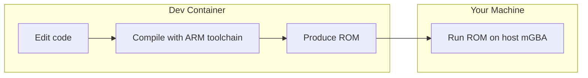
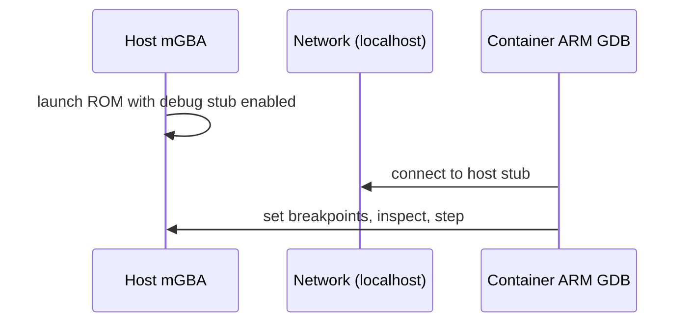
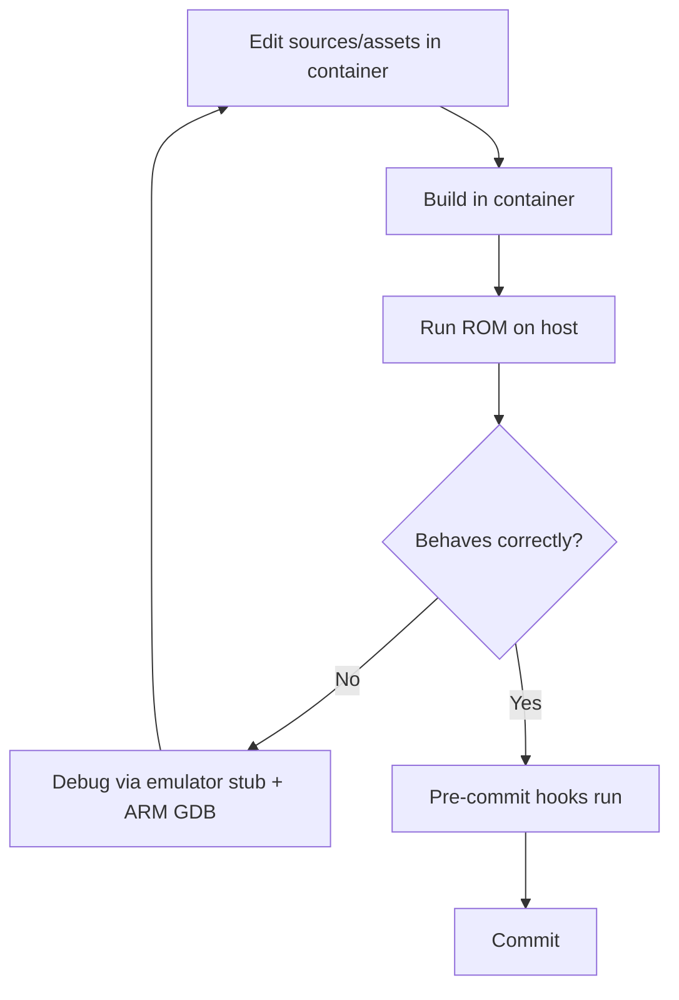

# Development Workflow

This page describes **how to work on the project day to day**: building,
testing, debugging, version control, and contributing. The exact shell commands
live in the repository `README.md`; this page explains the *why* behind each
step and the conventions to follow. For environment setup, see
[Getting Started](getting-started.md).

## The golden rule: build in the container, run on the host

The single most important workflow principle:

- **Build inside the container**, because that is where the ARM cross-compiler
  lives. Attempting to build on the host fails with "command not found."
- **Run on the host**, because mGBA with a graphical window is simplest there
  (no display-forwarding headaches).
- **Debug from the container** when you need the ARM debugger, connecting over
  the network to an emulator running on the host.

This split is deliberate and keeps each side doing what it is best at.

## Building process overview

Building is a single step from the developer's point of view, but it does several
things under the hood:

1. **Process assets.** Graphics and audio in the game folders are converted into
   the binary forms the handheld expects.
2. **Compile sources.** Game code, shared engine code, and the engine itself are
   cross-compiled for ARM.
3. **Link.** The pieces link into a ROM file (and a debug ELF).
4. **Report.** The output ROM appears at the repository root, named for the
   configured target.

There are several equivalent ways to trigger a build (a Make target, a wrapper
script, a direct container command, or the editor's "run build task" shortcut).
Pick whichever fits your flow; they all produce the same ROM.

> **First build is slow.** The very first build assembles the container image,
> which takes a few minutes. After that, incremental builds are fast.

## Testing methodology

There is no large automated unit-test harness in the current project; testing is
primarily **manual and behavioral**, supplemented by a headless run for
automation:

- **Manual play testing** in the emulator is the main loop. After a change,
  load the ROM and verify the affected behavior: Does the duck jump as intended?
  Does a new hazard trigger at the right moment? Does death/respawn still work?
- **Clearability testing for levels.** After editing a stage, walk the intended
  path and confirm every required jump is achievable within the physics envelope
  (climbs ≤ 16px, gaps ≤ 40px per the [Level Design](level-design.md) rules).
- **Headless / CI run.** A helper script runs the ROM without a graphical
  window, useful for automated pipelines that just need to confirm the ROM
  boots and runs a bit.
- **Save-state / persistence checks.** Verify that deaths, the timer, level
  progression, and save slots survive a quit-and-reload.

A practical manual test checklist for any gameplay change:

| Area | What to verify |
|------|----------------|
| Movement | Acceleration, jump height, coyote/buffer feel, screen-edge bounce |
| Traps | Activation timing, hit behavior, reset on respawn |
| Triggers | Fire at the intended zone; linked traps respond correctly |
| Progression | Door advances to the right stage; final stage triggers the kiss scene |
| Persistence | Deaths/timer/level saved and reloaded per slot |
| Pause | Menu navigates; continue/restart/title behave correctly |

## Debugging approach

Debugging combines the emulator's remote stub with the container's ARM
debugger:

The recommended pattern:

1. **Start the emulator on the host** with its debug stub enabled, so it listens
   for a debugger connection.
2. **Connect the ARM debugger from the container** to that stub (the container
   is the only place the ARM debugger exists; it reaches the host emulator over
   the container network).
3. **Set breakpoints and inspect** as you would in any native debugging session.

For faster iteration without full debugger setup, the editor's integrated build
and debug launchers wrap the right commands for the right environment
(container vs. host). Headless mode plus console logging is also available for
quick checks.

> **Why the split again?** The build toolchain and the ARM debugger only exist
> in the container; a comfortable emulator display only exists on the host. The
> network connection between them is the bridge.

### Debugging tips

- **Reproduce with the minimal ROM.** If something breaks, confirm it with a
  clean build before suspecting environment issues.
- **Watch for resource ceilings.** Sudden graphical glitches or sprite
  disappearance can mean a sprite-slot or palette budget was exceeded; check
  that stages release resources on unload.
- **Use headless runs** to catch crashes that don't need a display.

## Version control practices

The project uses Git with submodules for the engine and shared engine code.
Conventions:

- **Clone with submodules** (recursive clone). If submodules are missing after a
  clone or after pulling, update and initialize them.
- **Commit small, focused changes** with clear messages. The repository uses a
  mailmap, so commit authorship is normalized — respect existing attribution.
- **Keep generated output out of version control.** Build artifacts (the ROM,
  ELF, build directory) are ignored; commit sources and assets, not outputs.
- **Coordinate asset renames carefully,** since level data references assets by
  derived names — a rename must update every reference.

## Contribution guidelines

### Code style & automated checks

Consistent style is enforced before commits using pre-commit hooks backed by
`clang-format` (formatting) and `clang-tidy` (static analysis/lints). These run
automatically in the container. If you work outside the container, you need
pre-commit plus the same linters installed locally. Let the hooks reformat your
code rather than fighting them — the goal is uniform style across contributors.

### How to make a change well

1. **Read the relevant concept doc first** (this documentation set) so your
   change fits the architecture rather than fighting it.
2. **Make the smallest change that achieves the goal.** Favor composition and
   the existing patterns (data-driven levels, shared trap base, resettable
   interface) over new bespoke mechanisms.
3. **Keep the build green and tests manual-passing** — verify in the emulator
   before submitting.
4. **Update documentation** if you change a concept, add a subsystem, or alter
   a workflow. The docs are part of the contribution.
5. **Run the pre-commit hooks** so style/lint issues don't block the change.

### Design conventions to honor

- **Stay data-driven** for level content; don't hard-code stage specifics into
  gameplay logic.
- **Respect the physics envelope** when placing platforms.
- **Match themes** when adding art or hazards.
- **Preserve the forgiving-feel mechanics** (coyote time, jump buffering,
  variable jump height) unless there is a strong reason to change them.
- **Keep the personality** — the duck theme and light tone are part of the
  project's identity.

## Iteration loop (summary)

## Related
- [Index](index.md)
- [Getting Started](getting-started.md)
- [Project Architecture](architecture.md)
- [System Internals](system-internals.md)
- [Extensibility Guide](extensibility.md)
- [Glossary](glossary.md)