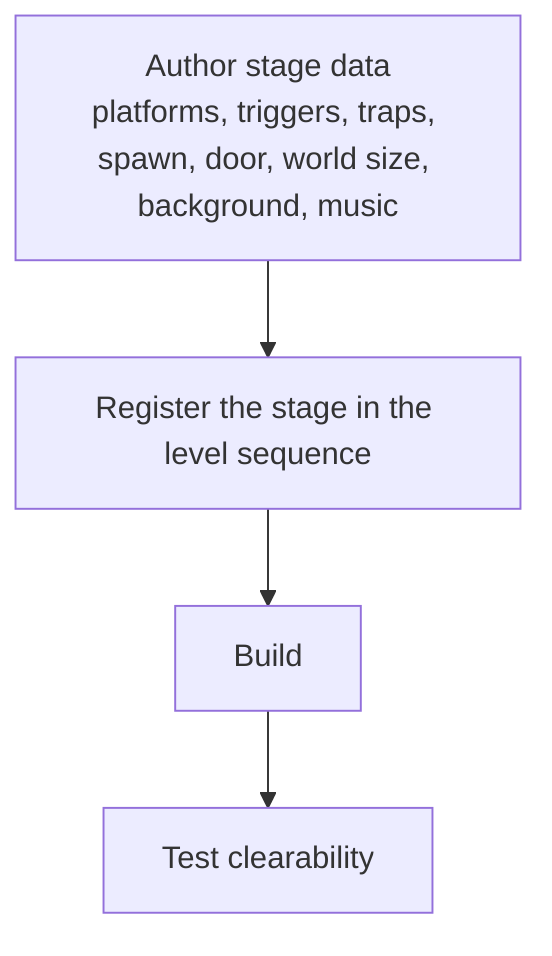
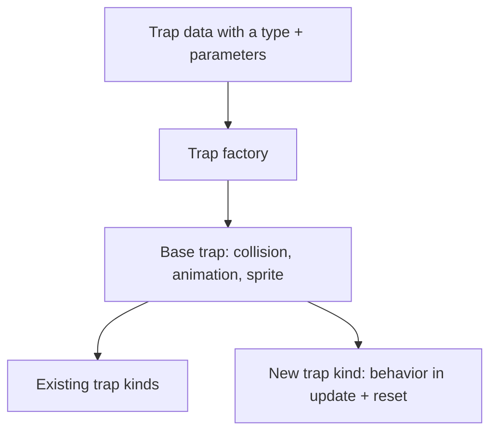
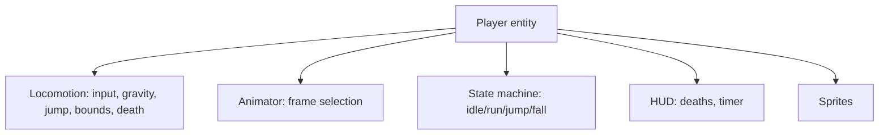

# Extensibility Guide

This page explains **how to extend the game**: adding a new stage, creating a
new trap type, modifying player behavior, integrating new assets, and extending
the systems. It stays conceptual — describing the *places and patterns* to touch
and the order to do it in — without pasting code. For the concepts behind each
subsystem, follow the links.

Before extending, skim [Project Architecture](architecture.md) and
[Level Design](level-design.md) so your addition fits the existing design rather
than fighting it.

## Adding a new level

Because stages are **data-driven**, adding one is mostly a data authoring task,
not a code-writing task.

### Conceptual steps

1. **Gather the theme assets** (background tilemap, platform tileset, hazard
   sprites, music track). If reusing existing themes, this step is free — see
   [Asset Management](asset-management.md).
2. **Author the platform list.** Place solid surfaces using the coordinate model
   (smaller Y is higher) and respect the physics envelope — **climbs ≤ 16px,
   horizontal gaps ≤ 40px** per jump. See [Level Design](level-design.md).
3. **Author the trigger list.** Define the invisible rectangles that will
   activate your timed hazards; optionally start one already active.
4. **Author the trap list.** For each hazard, choose a trap type and provide its
   appearance, optional animation, activation (trigger index, or direct player
   tracking for a chase trap), and the behavior parameters its type needs
   (acceleration for moving, waypoints for path, follow distance/speed for
   chase).
5. **Set spawn, door, and world size.** The spawn is where the duck begins and
   respawns; the door is the exit; the world size determines whether the stage
   scrolls and sets the duck's horizontal bounce boundary.
6. **Register the stage** in the ordered list of stages so the game knows it
   exists and where it sits in the progression. The list drives the sequence of
   worlds and the final-stage → kiss-scene transition.
7. **Build and test.** Verify the stage loads, every required jump is
   achievable, and hazards activate at the intended moments.

### Design reminders

- Keep the stage readable: the player should see hazards and landings from the
  takeoff point.
- Match the theme of the surrounding worlds (or introduce a new theme
  deliberately, with its own background, music, and art).
- Respect the entity-count budgets (platforms, triggers, traps) configured for
  a stage; raise them only with a reason.

## Creating a new trap type

Traps follow a **shared base + factory** pattern, so a new trap kind slots into
the existing flow:

### Conceptual steps

1. **Define the behavior in your head first.** When does it activate? How does
   it move (or not)? What does it reset to? What parameters does it need from
   stage data?
2. **Add the type to the trap-type vocabulary** so stage data can request it,
   and add any new parameters its behavior needs to the unified trap-data
   structure (used only by your type).
3. **Implement the trap as a subclass of the base trap.** Reuse the base for
   collision, optional animation, and sprite handling; override the per-frame
   update to implement your motion, and override reset to restore the trap's
   initial state for respawns.
   - If your trap moves by physics/acceleration, model it on the moving trap.
   - If it follows a route, model it on the path trap.
   - If it watches the player, model it on the chase trap (which bypasses
     physics and reads the player directly).
   - If it is purely static, the base trap alone may suffice.
4. **Teach the factory to construct your type** from a stage-data entry, wiring
   in its parameters and, if applicable, its linked trigger.
5. **Wire it into the level's trap list** by adding an entry that uses your new
   type.
6. **Build and test** activation, hit behavior, and reset-on-death.

### Why this pattern is worth following

The base trap centralizes the things every hazard shares (collision with the
player, optional looping animation, sprite registration). By adding only the
*difference* (movement + reset), a new trap stays small and inherits correct
death/hit behavior automatically. The generic **resettable** interface also
means your trap re-arms on respawn without the level manager needing to know
its type.

## Modifying player behavior

The player is **composed** of focused parts, so changes go to the right place:

| To change… | Modify |
|------------|--------|
| Movement speed, acceleration, gravity, jump strength, coyote/buffer frames, death height, screen-edge bounce | The **central player configuration** (physics values), then verify levels still clear |
| How input becomes motion; ground detection; variable jump | **Locomotion** |
| Which sprite frames appear for a state/facing | **Animator** and the player configuration's frame tables |
| The coarse movement states and their transitions | **State machine** |
| HUD content or layout | **HUD** |
| Death/respawn flow and what systems get notified | The player entity's death handling |

### Adjusting the physics envelope (carefully)

The jump/climb envelope is what level spacing relies on. If you change
acceleration, jump speed, gravity, or fall-speed clamp, you **change the envelope**, and
existing stages may no longer be clearable (or may become trivial). The
responsible approach:

1. Adjust the central player configuration values.
2. Re-derive the new max climb and max horizontal travel.
3. Update the documented spacing limits in the level-design material.
4. Audit existing stages against the new envelope; adjust layouts that depended
   on the old one.

### Adding a new player capability

Prefer a new collaborator or a new state over entangling existing ones. For
example, a double jump would be a locomotion concern (consume a second jump
under the right conditions) plus a state-machine addition (a new ascent state)
plus animation frames — each in its natural home, keeping the parts decoupled.

## Integrating new assets

See [Asset Management](asset-management.md) for the pipeline. The short version:

1. **Add the asset source pair** (image + metadata) to the right folder —
   `global/` if shared across worlds, or the specific world folder if
   theme-specific.
2. **Pick a name** that fits the existing pattern; the build derives a usable
   asset name from it.
3. **Add music** as a tracker module with a name that fits the existing audio
   naming, if introducing a new world's theme.
4. **Reference the resulting asset** from stage data (background item, music
   item, platform/hazard sprite items) and from code where an entity type needs
   it (e.g. a new trap's default sprite comes from stage data, so usually no
   code change).
5. **Build** so the asset is registered, then verify it appears correctly in
   the emulator.

A new trap or platform almost always takes its art from stage data, so adding
art is frequently just "drop the files, reference them, build."

## Extending game systems

The project has clear extension points and patterns to reuse:

| Extension goal | Recommended approach |
|----------------|----------------------|
| A new scene (e.g. a hub, a minigame) | Create a scene and ask the scene manager to set it as the next scene; follow how the start/level/kiss scenes transition. |
| A new resettable hazard/feature | Implement the shared resettable interface so the level manager resets it on death without special-casing. |
| A new trigger-driven effect | Use an existing trigger and add behavior bound to it, rather than inventing a parallel activation channel. |
| A new persistent stat | Add a fixed-width field to the saved game-state record (keeps the save layout predictable). |
| A new save slot | Increase the slot count in the data manager's save configuration; the start screen presents slots accordingly. |
| More entity capacity per stage | Raise the configured container limits deliberately, with awareness of the memory budget (see [System Internals](system-internals.md)). |

### Principles that keep extensions clean

- **Compose, don't entangle.** Add small focused pieces rather than growing one
  class to do everything.
- **Stay data-driven.** Put stage/level specifics in data, not code paths.
- **Use the shared interfaces** (resettable, collision layers) instead of
  bespoke mechanisms.
- **Respect the budgets** (memory, sprite/palette slots, SRAM writes, frame
  time) — see [System Internals](system-internals.md).
- **Preserve the feel and theme.** Don't quietly remove the forgiving jump
  mechanics or break a world's visual identity.
- **Update documentation** with your addition — the docs are part of the
  contribution.

## A worked example: adding one new hazard

Tying the patterns together, here is the mental path to a new hazard, say a
"spinning blade patrol that drops when the duck passes underneath":

1. **Choose the base behavior.** It moves along a route once triggered → model
   it on the path trap, but add a downward phase. Decide its parameters
   (route, speed, drop trigger).
2. **Add the data fields** its behavior needs and a type label so stage data can
   request it.
3. **Implement** the subclass: reuse base-trap collision/animation; in update,
   follow the route until the trigger fires, then descend; on reset, return to
   the top of the route.
4. **Teach the factory** to build it and bind its trigger.
5. **Add the art** (image + metadata) to the world's folder; reference it in
   stage data.
6. **Place it** in a stage with a trigger positioned so the blade drops where
   the duck can see it start and react.
7. **Build and test** activation, hit, and reset-on-death.

Each step used an existing pattern — base trap, factory, trigger, data-driven
placement, asset pair — which is exactly how the system is designed to be
extended.

## Related
- [Index](index.md)
- [Level Design](level-design.md)
- [Components](components.md)
- [Asset Management](asset-management.md)
- [Project Architecture](architecture.md)
- [Glossary](glossary.md)