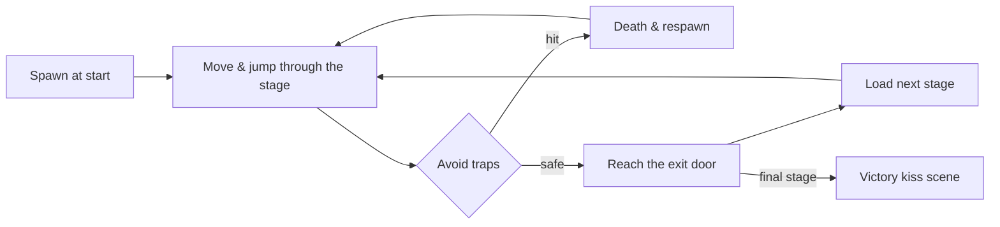

# Game Concepts

This page describes **what the game is like to play** and the ideas that shape
that experience. It is written for designers, new contributors, and anyone who
wants to understand the gameplay before touching the systems that implement it.
For how the systems work, see [Components](components.md); for how to build a
stage, see [Level Design](level-design.md).

## Core gameplay loop

The game is a classic side-scrolling platformer with a duck as the protagonist.
A single run through a stage follows this loop:

The loop is short and forgiving: dying sends the duck back to the spawn point,
the **death counter** increments, and the player retries immediately. The
**run timer** keeps counting so speedrun-style play is measurable, and a
level's personal-best clear time is recorded (and flashed on-screen) whenever
it's beaten - see [New Best banner](#new-best-banner) below.

## Player capabilities and controls

The duck can:

- **Walk** left and right with acceleration, ramping up to a top speed.
- **Jump** with variable height (hold the button longer to jump higher).
- **Fall** under gravity with a clamped maximum fall speed, so long drops are
  survivable and predictable.

The control scheme is intentionally simple:

| Input | Effect |
|-------|--------|
| D-Pad left / right | Move horizontally |
| A button | Jump |
| Start button | Pause (opens the pause menu) |

The pause menu uses D-Pad up/down and A to navigate, mirroring the start-screen
controls for consistency.

### Feel-oriented mechanics

Several mechanics exist purely to make the duck *feel* responsive:

- **Acceleration & max speed.** Movement ramps up rather than snapping, which
  makes the duck feel weighty but still nimble.
- **Coyote time.** For a few frames after leaving a ledge, the duck can still
  jump, forgiving late inputs.
- **Jump buffering.** Pressing jump a few frames before landing still triggers a
  jump on contact, forgiving early inputs.
- **Variable jump height.** The longer the jump button is held, the higher the
  duck rises, enabling precise short hops and full leaps.
- **Fall speed clamp.** Prevents runaway fall speeds so the player can still
  steer while descending.
- **Ground braking.** How quickly the duck comes to a stop after releasing
  the D-Pad is its own tuning knob, separate from how quickly it speeds up.
  Every world uses the same, snappy default - except Forest's mossy floor
  (see below), which trades some of that precision for a distinct feel.

Together, these create a "tight but forgiving" feel that the [Level Design](level-design.md)
spacing rules then respect. Braking is the one exception a level can opt
out of on its own terms: it only changes how far the duck skids to a stop,
never how high or far a jump can reach, so it can vary by level without
risking a platform becoming unreachable.

## Game progression

### World sequence

The game is structured as a sequence of **stages** grouped by theme. The
player moves from one stage to the next by reaching the **door** at the end of
each stage. After the final stage, the game switches to a celebratory **kiss
scene**.

The current world themes, in order, are:

| Theme | Mood | Visual palette |
|-------|------|----------------|
| Bathtub (World 1, 4 levels incl. boss) | Calm introduction | Blue bubbles, platforms |
| Sewerage (World 2, 3 levels incl. boss) | Industrial hazards | Pipes, cans, rusty nails |
| Forest (World 3, 3 levels incl. boss) | Misty climb | Trees, fog, mushrooms, slither arms |
| Village (World 4, 3 levels incl. boss) | Bright open spaces | Flowers, baskets, bugs, nests, an ambush bug |
| Dungeon (World 5, 3 levels incl. boss) | Final gauntlet | Barrels, bars, chests, an ambush mimic, axes, thwomps |

Each theme pairs a tilemap background, a music track, a set of themed trap
sprites, and a platform tileset. This pairing is what gives each world its
distinct identity. Forest also carries the theme into ground feel: its two
non-boss levels have a noticeably slippery, mossy floor - the duck skids
roughly twice as far before stopping there as it does everywhere else. The
boss arena deliberately keeps normal footing, so the dodge-heavy fight
doesn't also fight the floor.

### Save slots

The player can choose among three **save slots** on the start screen. Each
slot tracks the current stage, total deaths, the run timer, the chosen
music/SFX volume, the Hard Mode unlock/toggle state, a personal-best clear
time per level, and a no-death-clear badge per level.

Per-level best times and no-death badges are treated as durable records
rather than "current run" progress: finishing the entire game resets
level/deaths/timer to start a fresh run, but best times, no-death badges, and
the Hard Mode unlock all survive that reset (the Hard Mode *toggle* itself
does not - see [Hard Mode](#hard-mode) below).

### Pause & recovery

During gameplay, opening the pause menu offers:

- **Continue** — resume the current stage.
- **Restart Level** — reset the current stage's traps and respawn the duck.
- **Options** — adjust music and SFX volume (0-4), without leaving the
  paused overlay. Persisted per save slot. Once Hard Mode has been unlocked
  (see below), a third row lets the player toggle it on/off from here too.
- **Title Screen** — leave to the title (progress is saved).

### Hard Mode

Hard Mode is an unlockable, per-save-slot difficulty toggle aimed at replay
value once a save has already finished the game once:

- **Unlock condition.** Completing the game (reaching the final door of
  World 5's finale) permanently unlocks Hard Mode for that save slot. The
  unlock is a one-way achievement flag - it is never re-locked, including
  by starting a fresh run on the same slot.
- **Toggling it.** Once unlocked, a "Hard Mode" row appears at the bottom of
  the pause menu's Options sub-menu, alongside Music and SFX. Left/Right (or
  either direction on the row) flips it On/Off; the change commits the same
  way Music/SFX do - once, on leaving the sub-menu, not on every keypress.
- **Effect.** While enabled, Moving, Chase, and Ambush traps move faster
  (their velocities are scaled up). Path traps are deliberately unaffected,
  since a patrol's speed is authored as a frame count between waypoints
  rather than a velocity.
- **Persistence.** The On/Off toggle itself resets to Off on a fresh
  run/reset, the same way the audio volume settings do - only the *unlock*
  is a permanent record.

Hard Mode reuses the exact same level layouts, traps, and triggers; nothing
about a stage's data changes. It exists purely as a value multiplier applied
at trap-construction time, so it costs no extra level content or entity
budget - see [Components — Trap System](components.md).

## Level structure (player-facing view)

From the player's seat, every stage has the same skeleton:

1. A **spawn point** where the duck appears.
2. A series of **platforms** forming a path.
3. A set of **traps** and **trigger zones** that activate hazards.
4. A single **door** marking the exit.

Stages are sized either to one screen or to a wider scrolling world. Scrolling
stages use a camera that follows the duck within the world bounds, while
single-screen stages effectively pin the camera.

## Trap types & behaviors

From a player's perspective, traps come in a few recognizable kinds:

- **Static hazards** sit in gaps or on ledges and are always dangerous. They
  include things like rusty bars, nests, bushes, and disguised mimics.
- **Triggered hazards** are dormant until the duck steps into an invisible
  **trigger zone**, at which point they begin moving — falling bricks, rising
  arms, charging cans.
- **Patrol hazards** follow a fixed route, sweeping an area on a path (e.g. a
  branch sweeping back and forth, a bubble tracing a figure-8).
- **Chasing hazards** trail behind the duck and close the gap only when the
  duck advances. Standing still or retreating does not make them retreat, so
  they punish hesitation. This pressure mechanic appears in the final world.
- **Ambush hazards** look like harmless scenery (or a genuine decoration,
  like a chest among other chests) until the duck gets close, then lunge
  once and retreat. They punish approaching without care rather than
  punishing hesitation.

Moving, Chase, and Ambush hazards all move faster when Hard Mode is enabled -
see [Hard Mode](#hard-mode) above.

For the internal behavior of each, see [Components — Trap System](components.md).

## Trigger zones

**Triggers** are invisible rectangular zones. They have no visual presence;
they only react to the duck entering them. A trigger can:

- Start in the **off** state (the common case) and switch to **on** once the
  duck crosses into it.
- Start **already on**, so a hazard is moving from the moment the stage loads.

Triggers let a single stage have multiple "moments": a falling brick released
mid-jump, a hazard that rises as the duck climbs, a flying pest released later
in the run. Without triggers, every moving hazard would be permanently active,
which would be hard to design around and visually chaotic.

## Boss levels

Every world's gameplay culminates in a **boss level**: a single, mostly flat corridor
where the challenge is entirely about reading and dodging a sequence of
attacks rather than platforming, the way a Hollow Knight boss arena plays.

- **Attack waves.** Invisible trigger zones fire hazards in sequence as
  the duck advances - falling slams, charging dashes, or rising arms,
  depending on the world's theme.
- **A constant patrol.** One hazard (usually a sweeping `PATH` trap) is
  active for the whole fight, so the arena never feels static between
  triggered attacks.
- **Punish lingering, not hesitating.** A mid-arena `AMBUSH` hazard,
  disguised as scenery, lunges only if the duck stays close - it rewards
  pressing on rather than camping a safe spot.
- **An enrage pursuer (Worlds 4-5).** A `CHASE` hazard trails the duck for
  the whole fight, closing the gap whenever the duck advances. It keeps
  forward momentum mandatory in the two hardest boss fights.
- **The door is the win condition.** There is no health bar or hit
  count - reaching the door at the far end of the arena is "defeating"
  the boss.

### World 5's coda: the finale

World 5 adds one more level after its boss - a deliberate tonal reset. No
traps, no triggers, just a single unbroken walkway leading to Susanne. It
exists purely to let the tension of the boss fight settle before the game's
ending, the way a quiet epilogue follows a climax. Mechanically it's still
"reach the door" - Susanne stands in for the door itself, so the same
completion path applies, just without anything to dodge on the way there.
Reaching her is also what unlocks Hard Mode for the save slot - see
[Hard Mode](#hard-mode) above.

## Audio & visual identity

### Music

Each world has its own music track, selected at level-load time and played for
the duration of the stage. Menu, start, and end screens use their own cues.
Sound effects (jump, footsteps, trap hits, deaths) play on top of music.

### Tilemap backgrounds

Each world's backdrop is a tilemap background asset. Backgrounds are large
enough to support the world's scroll range, so a wider stage uses a wider
background and the camera pans across it.

### Animated sprites

The duck, the door, mimics, and several traps use frame-based animation. The
door has its own animation; mimics cycle frames to look "alive"; the duck's
animation depends on its current movement state.

## HUD (what the player sees)

A small **head-up display** shows:

- The **death counter** (incremented each respawn).
- The **run timer** (minutes : seconds : centiseconds).

Both are owned by the player's HUD component and toggle visibility when the
game is in a non-gameplay scene (e.g. title or kiss).

## Progress feedback

Beyond the per-frame HUD, a few moments call out progress explicitly:

### New Best banner

Finishing a level in less time than its previously stored personal-best
freezes the level-clear moment on a "New Best!" banner, showing the new
best-time (mm:ss.cc) and a "Press A to continue" prompt. The game only
advances to the next stage (or to the kiss scene, on the final level) once
the player acknowledges it with A or Start - the level clear itself is not
delayed, only the transition that follows it.

### No-death clears

If a level is cleared during an attempt in which the duck never died even
once, that level earns a permanent **no-death clear** badge for the save
slot. Level Select marks it with a trailing `*` next to that level's
best-time readout, so a fully clean clear is visually distinct from an
ordinary one. Like best times, this badge survives a full-game reset.

### World-select stats

Pressing B on the start screen (see below) leads to World Select, which also
shows a one-line summary for the loaded save slot: total deaths accumulated
on that slot, and how many levels have a recorded best time out of the total
level count. It's a quick "how am I doing on this save" readout, computed
from data that's already being tracked - no separate counter is needed.

## Death, respawn, and difficulty

Death is cheap: the duck respawns at the stage's spawn point with no lives
system, and the death counter is the only penalty. This encourages experimentation
and fast retries, which suits short stages. The difficulty therefore comes from
trap timing and platform layout (and, once unlocked, Hard Mode's speed
multiplier), not from limited attempts.

## Thematic personality

The game embraces a lighthearted identity: the duck, the kiss scene at the
end, whimsical trap names, and playful sound cues. This personality is part of
the design intent and should be preserved when extending the game — new content
that clashes with it should be reconsidered or thematically adapted.

## Design philosophy summary

- **Forgiving controls, demanding layouts.** The duck handles well; the stages
  are where the challenge lives.
- **Short, readable stages.** Each stage is small enough to memorize in a few
  attempts.
- **Visible hazards, invisible triggers.** Players should always be able to see
  what might hurt them; triggers stay invisible but their effects should be
  legible.
- **Thematic coherence.** Every element in a world should feel like it belongs
  to that world's theme.
- **Replay without new content.** Hard Mode raises the ceiling for players who
  already finished the game using the existing level roster, rather than
  demanding new stages for every difficulty step.

## Related
- [Index](index.md)
- [Level Design](level-design.md)
- [Components](components.md)
- [Asset Management](asset-management.md)
- [Glossary](glossary.md)