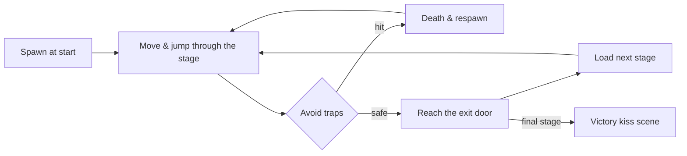

# Game Concepts

This page describes **what the game is like to play** and the ideas that shape
that experience. It is written for designers, new contributors, and anyone who
wants to understand the gameplay before touching the systems that implement it.
For how the systems work, see [Components](components.md); for how to build a
stage, see [Level Design](level-design.md).

## Core gameplay loop

The game is a classic side-scrolling platformer with a duck as the protagonist.
A single run through a stage follows this loop:

The loop is short and forgiving: dying sends the duck back to the spawn point,
the **death counter** increments, and the player retries immediately. The
**run timer** keeps counting so speedrun-style play is measurable.

## Player capabilities and controls

The duck can:

- **Walk** left and right with acceleration, ramping up to a top speed.
- **Jump** with variable height (hold the button longer to jump higher).
- **Fall** under gravity with a clamped maximum fall speed, so long drops are
  survivable and predictable.

The control scheme is intentionally simple:

| Input | Effect |
|-------|--------|
| D-Pad left / right | Move horizontally |
| A button | Jump |
| Start button | Pause (opens the pause menu) |

The pause menu uses D-Pad up/down and A to navigate, mirroring the start-screen
controls for consistency.

### Feel-oriented mechanics

Several mechanics exist purely to make the duck *feel* responsive:

- **Acceleration & max speed.** Movement ramps up rather than snapping, which
  makes the duck feel weighty but still nimble.
- **Coyote time.** For a few frames after leaving a ledge, the duck can still
  jump, forgiving late inputs.
- **Jump buffering.** Pressing jump a few frames before landing still triggers a
  jump on contact, forgiving early inputs.
- **Variable jump height.** The longer the jump button is held, the higher the
  duck rises, enabling precise short hops and full leaps.
- **Fall speed clamp.** Prevents runaway fall speeds so the player can still
  steer while descending.

Together, these create a "tight but forgiving" feel that the [Level Design](level-design.md)
spacing rules then respect.

## Game progression

### World sequence

The game is structured as a sequence of **stages** grouped by theme. The
player moves from one stage to the next by reaching the **door** at the end of
each stage. After the final stage, the game switches to a celebratory **kiss
scene**.

The current world themes, in order, are:

| Theme | Mood | Visual palette |
|-------|------|----------------|
| Ocean (World 1) | Calm introduction | Blue bubbles, platforms |
| Factory (World 2) | Industrial hazards | Pipes, cans, rusty nails |
| Forest (World 3) | Misty climb | Trees, fog, mushrooms, slither arms |
| Garden (World 4) | Bright open spaces | Flowers, baskets, bugs, nests |
| Dungeon (World 5) | Final gauntlet | Barrels, bars, chests, mimics, axes, thwomps |

Each theme pairs a tilemap background, a music track, a set of themed trap
sprites, and a platform tileset. This pairing is what gives each world its
distinct identity.

### Save slots

The player can choose among three **save slots** on the start screen. Each
slot tracks the current stage, total deaths, and the run timer. Save data is
stored to SRAM and loaded on boot.

### Pause & recovery

During gameplay, opening the pause menu offers:

- **Continue** — resume the current stage.
- **Restart Level** — reset the current stage's traps and respawn the duck.
- **Title Screen** — leave to the title (progress is saved).

## Level structure (player-facing view)

From the player's seat, every stage has the same skeleton:

1. A **spawn point** where the duck appears.
2. A series of **platforms** forming a path.
3. A set of **traps** and **trigger zones** that activate hazards.
4. A single **door** marking the exit.

Stages are sized either to one screen or to a wider scrolling world. Scrolling
stages use a camera that follows the duck within the world bounds, while
single-screen stages effectively pin the camera.

## Trap types & behaviors

From a player's perspective, traps come in a few recognizable kinds:

- **Static hazards** sit in gaps or on ledges and are always dangerous. They
  include things like rusty bars, nests, bushes, and disguised mimics.
- **Triggered hazards** are dormant until the duck steps into an invisible
  **trigger zone**, at which point they begin moving — falling bricks, rising
  arms, charging cans.
- **Patrol hazards** follow a fixed route, sweeping an area on a path (e.g. a
  branch sweeping back and forth, a bubble tracing a figure-8).
- **Chasing hazards** trail behind the duck and close the gap only when the
  duck advances. Standing still or retreating does not make them retreat, so
  they punish hesitation. This pressure mechanic appears in the final world.

For the internal behavior of each, see [Components — Trap System](components.md).

## Trigger zones

**Triggers** are invisible rectangular zones. They have no visual presence;
they only react to the duck entering them. A trigger can:

- Start in the **off** state (the common case) and switch to **on** once the
  duck crosses into it.
- Start **already on**, so a hazard is moving from the moment the stage loads.

Triggers let a single stage have multiple "moments": a falling brick released
mid-jump, a hazard that rises as the duck climbs, a flying pest released later
in the run. Without triggers, every moving hazard would be permanently active,
which would be hard to design around and visually chaotic.

## Audio & visual identity

### Music

Each world has its own music track, selected at level-load time and played for
the duration of the stage. Menu, start, and end screens use their own cues.
Sound effects (jump, footsteps, trap hits, deaths) play on top of music.

### Tilemap backgrounds

Each world's backdrop is a tilemap background asset. Backgrounds are large
enough to support the world's scroll range, so a wider stage uses a wider
background and the camera pans across it.

### Animated sprites

The duck, the door, mimics, and several traps use frame-based animation. The
door has its own animation; mimics cycle frames to look "alive"; the duck's
animation depends on its current movement state.

## HUD (what the player sees)

A small **head-up display** shows:

- The **death counter** (incremented each respawn).
- The **run timer** (minutes : seconds : centiseconds).

Both are owned by the player's HUD component and toggle visibility when the
game is in a non-gameplay scene (e.g. title or kiss).

## Death, respawn, and difficulty

Death is cheap: the duck respawns at the stage's spawn point with no lives
system, and the death counter is the only penalty. This encourages experimentation
and fast retries, which suits short stages. The difficulty therefore comes from
trap timing and platform layout, not from limited attempts.

## Thematic personality

The game embraces a lighthearted identity: the duck, the kiss scene at the
end, whimsical trap names, and playful sound cues. This personality is part of
the design intent and should be preserved when extending the game — new content
that clashes with it should be reconsidered or thematically adapted.

## Design philosophy summary

- **Forgiving controls, demanding layouts.** The duck handles well; the stages
  are where the challenge lives.
- **Short, readable stages.** Each stage is small enough to memorize in a few
  attempts.
- **Visible hazards, invisible triggers.** Players should always be able to see
  what might hurt them; triggers stay invisible but their effects should be
  legible.
- **Thematic coherence.** Every element in a world should feel like it belongs
  to that world's theme.

## Related
- [Index](index.md)
- [Level Design](level-design.md)
- [Components](components.md)
- [Asset Management](asset-management.md)
- [Glossary](glossary.md)