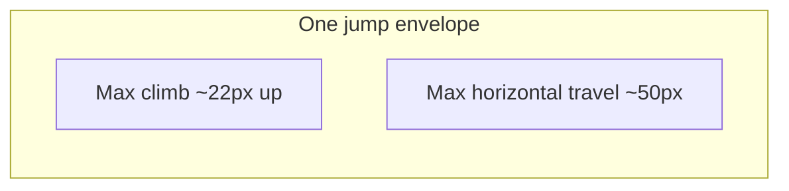
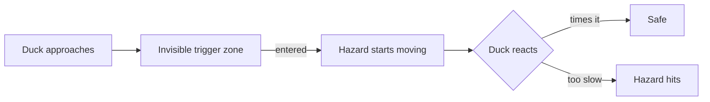
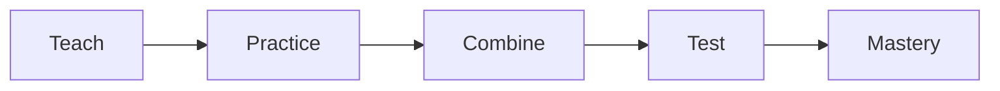

# Level Design

This page is written for anyone who wants to **shape a stage**: a designer, a
contributor tuning difficulty, or a developer adding new content. It explains
how stages are put together, the principles that keep them playable, and the
philosophy behind progression. No code — just the design model.

For the gameplay itself, see [Game Concepts](game-concepts.md); for the systems
that realize a stage, see [Components — Level Management](components.md).

## Level anatomy

Every stage is described by a single declarative definition that contains:

| Element | Purpose |
|---------|---------|
| **Platforms** | Solid surfaces the duck stands on and jumps between. |
| **Triggers** | Invisible rectangles that activate hazards when entered. |
| **Traps** | Hazards, each with a type, appearance, and behavior. |
| **Background** | The themed tilemap behind everything. |
| **Music** | The stage's audio track. |
| **Spawn point** | Where the duck appears at the start (and after death). |
| **Door** | The exit that advances the game. |
| **World size** | Determines whether the camera scrolls and sets the duck's bounce edges. |

The same skeleton powers every world; only the contents and theme change.

## Coordinate system & orientation

Understanding the coordinate orientation is the key to placing anything:

- **Smaller Y = higher up.** Gravity increases Y; jumping decreases Y.
- The world is conceptually centered at the origin, and the camera shows a
  window into it.
- A stage whose world size matches the screen is single-screen; a wider world
  scrolls with the duck.

When you place platforms, think of Y as "height from the bottom": a platform at
Y = 60 sits near the floor of the visible area, while one at Y = −40 sits high
up.

## Platform placement principles

The most important design rule is **physics-derived spacing**. Because the
duck's movement envelope is fixed and known, every jumpable gap can be measured
in advance. A fully-held jump reaches roughly:

Based on the central movement configuration, a single fully-held jump can climb
about 22 pixels vertically and carry about 50 pixels horizontally. Descending is
essentially unconstrained in height as long as the duck stays above the death
height and the horizontal gap remains inside the same envelope.

To stay **provably clearable**, the established convention is:

- **Climbs ≤ 16px per jump.**
- **Horizontal gaps ≤ 40px per jump.**

These are deliberately *inside* the measured envelope (22 / 50), leaving a
comfort margin so the intended path is always achievable even with imperfect
input. Stays within these limits unless you explicitly want a risky, optional
leap.

### Other placement guidelines

- **Lead with a safe landing.** Give the player a reliable platform to start
  from before demanding a tricky sequence.
- **Readability first.** A player should be able to see the hazard *and* the
  landing spot from the takeoff point.
- **Ground hazards in gaps.** Placing static hazards in the spaces *between*
  platforms turns a casual stroll into a deliberate jump — the gap becomes the
  challenge, not the platform itself.
- **Progressive complexity.** Start with simple hops, then layer in timing,
  then combine multiple hazards.

## Trap configuration patterns

Traps are configured declaratively. The recurring design patterns are:

### 1. The always-on sentry (Base trap)

A static hazard placed in a gap or on a ledge. Use it to punish sloppy
landings and to force deliberate jumps. Animated base traps (e.g. a mimic) add
"is it safe?" tension without moving.

### 2. The timed release (Moving trap + trigger)

A hazard that lies dormant until the duck steps into a trigger zone, then
accelerates. Classic uses:

- **Falling hazard:** placed above the path, drops when the duck is near.
- **Rising hazard:** placed below, rises to intercept a climb.
- **Charging hazard:** sweeps horizontally across a corridor.

The pattern's power is that the hazard's *timing* is authored by the trigger
placement, so the same falling brick can feel like a surprise or a telegraph
depending on where its trigger sits.

### 3. The patrol (Path trap)

A hazard that sweeps a route defined by waypoints. Use it to guard a corridor or
to force the duck to time a crossing. Figure-8 and back-and-forth routes are
both supported. A patrol can be gated behind a trigger so it only starts once
the duck reaches the area it guards.

### 4. The pursuer (Chase trap)

A hazard that trails the duck and closes in as they advance, but never retreats.
This is a **pressure** mechanic: it punishes hesitation and standing still. It
turns an otherwise-safe run into a forced march and belongs in the most
intense, late-game stages. Because it ignores terrain, it flies freely over the
layout, so use it where the duck must keep running right.

## Trigger zones & their function

Triggers are the stage's **director**: they decide *when* things happen.

- Each moving/path trap references a trigger by index. When the duck enters the
  trigger's rectangle, every trap bound to that index activates.
- A trigger can start **already active**, so its hazards move from the moment
  the stage loads — useful for a constant patrol the duck must dodge from the
  start.
- Triggers are invisible by design. Players never see them, so a stage should
  remain fair *without* relying on the player knowing where a hidden trigger is
  — the resulting hazard motion should read as natural, not arbitrary.

**Designing with triggers:**

A good trigger is placed so the resulting hazard is *visible and reactable* the
instant it activates — the duck should see it begin moving and have time to
respond.

## Audio-visual theme integration

Each world is a coherent theme that ties visuals and audio together:

| World | Theme | Background | Themed hazards |
|-------|-------|-----------|----------------|
| 1 | Ocean | Underwater tilemap | Bubbles |
| 2 | Factory | Industrial tilemap | Pipes, cans, rusty nails |
| 3 | Forest | Misty forest tilemap | Mushrooms, slither arms, branches |
| 4 | Garden | Bright garden tilemap | Nests, bushes, bugs, bricks |
| 5 | Dungeon | Dark dungeon tilemap | Barrels, bars, chests, mimics, axes, thwomps |

When designing a stage, pick hazards that *belong* to the theme. A factory stage
with ocean bubbles breaks immersion. The goal is that a player who sees a frame
can tell which world they are in — background, platform art, hazard art, and
music all reinforcing one identity. See [Asset Management](asset-management.md)
for how these assets are organized.

## Level progression design philosophy

The stage sequence is designed as a **difficulty and complexity ramp**:

1. **Teach.** Early stages introduce one idea at a time — a simple gap, a single
   falling hazard. Forgiving layouts let the player learn the controls.
2. **Practice.** Next stages repeat the idea in slightly new contexts so the
   player builds muscle memory.
3. **Combine.** Mid stages combine multiple mechanics — timing a patrol while
   jumping a gap.
4. **Test.** Later stages introduce new hazards and tighter spacing that test
   everything learned.
5. **Mastery.** The final stage (dungeon) combines the full hazard vocabulary —
   static hazards, an animated mimic, a triggered thwomp, and a relentless
   chasing axe — into a climactic gauntlet.

### Guiding principles

- **Forgiving retries.** Death is cheap, so stages can be challenging without
  being punishing. Encourage experimentation.
- **Short, readable stages.** Each stage should be memorizable in a few
  attempts, rewarding pattern recognition.
- **A consistent difficulty curve.** Difficulty rises across the world sequence,
  not randomly, so the player always feels the challenge growing fairly.
- **Thematic escalation.** Later worlds feel more dangerous both mechanically
  and visually, matching the rising difficulty.

## A design workflow (conceptual)

1. **Sketch the path.** Decide the route from spawn to door and where the
   challenges sit.
2. **Lay platforms** within the physics envelope (climbs ≤ 16px, gaps ≤ 40px).
3. **Place the door** at the end of the path.
4. **Add triggers** at the moments you want hazards to fire.
5. **Assign traps** to each trigger (or leave them always-on), themed to the
   world.
6. **Set the world size** to make it single-screen or scrolling.
7. **Pick the background and music** for the theme.
8. **Test the clearability** — verify every required jump is achievable and every
   hazard is visible and reactable.

See [Extensibility Guide](extensibility.md) for the concrete steps to register
a new stage into the game.

## Related
- [Index](index.md)
- [Game Concepts](game-concepts.md)
- [Components](components.md)
- [Asset Management](asset-management.md)
- [Extensibility Guide](extensibility.md)
- [Glossary](glossary.md)