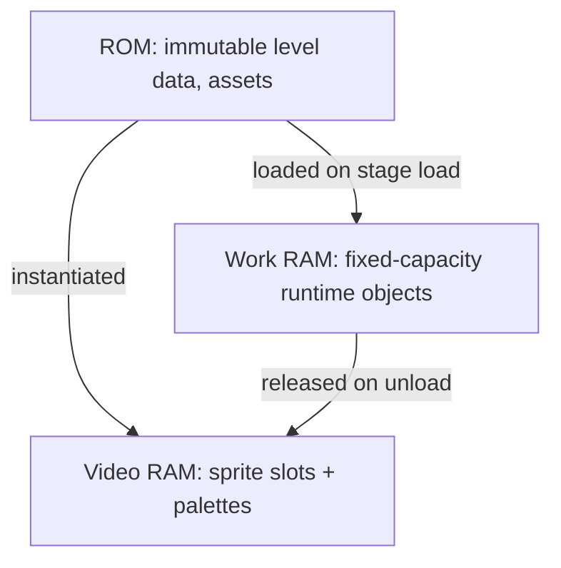

# System Internals

This page describes the **high-level technical considerations** that shape the
project: memory, performance, engine integration, platform constraints, and the
optimizations used to live within them. It stays conceptual — the goal is to
explain *why* the project is structured the way it is from a systems
perspective, not to expose implementation code or low-level engine internals.

For the logical structure, see [Project Architecture](architecture.md).

## Platform context

The Game Boy Advance is a 32-bit handheld with severe, fixed hardware budgets:

| Resource | Constraint | Design consequence |
|----------|-----------|--------------------|
| **Work RAM** | Small, fast memory | Avoid dynamic allocation churn; keep working sets compact. |
| **Video RAM / sprite slots** | Hard ceiling on on-screen sprites & tiles | Release stage resources on unload so the next stage fits. |
| **Palette entries** | Limited shared colors | Share palettes across entities; release with the stage. |
| **SRAM (save)** | Slow, limited writes | Batch saves; write only when meaningful state changes. |
| **CPU** | Fixed clock, no headroom | Avoid expensive math in hot loops (per-frame). |
| **ROM** | Fixed cartridge size | Keep assets compact; tracker music over streamed audio. |

Everything below is a response to one or more of these budgets.

## Memory management principles

The project's memory strategy is **static, predictable, and disciplined**:

- **Fixed-capacity containers for per-level objects.** The level manager holds
  platforms, triggers, traps, and resettable references in containers sized to
  the maximum the game expects. This avoids the heap growing and fragmenting
  over a long session — a real hazard on a device with little work RAM.
- **ROM-resident, immutable level data.** Stage definitions (platforms,
  triggers, traps, spawns, doors, world sizes) live as compile-time data and
  are read at load time. Design data costs ROM space but almost no work RAM
  until instantiated.
- **Long-lived objects at static lifetime.** The player, data manager, and
  level manager persist for the whole program and deliberately survive scene
  transitions, so they are not rebuilt repeatedly.
- **Borrowed references for shared services.** Systems that need the player or
  data manager hold references rather than copies, keeping a single authoritative
  instance and a small memory footprint.
- **Explicit resource release on unload.** When a stage leaves, its sprites and
  background are released so video-RAM slots and palette entries return to the
  pool for the next stage.

The overall principle: **move work to load/unload boundaries, keep the per-frame
path allocation-free.**

## Performance considerations

The per-frame update path is the hot loop, so it is kept lean:

- **No allocation in the frame loop.** Objects are created at load time and
  reused; the update step moves and collides them but does not allocate.
- **Lookup over arithmetic in the timer.** The run timer counts frames and uses
  precomputed conversions instead of division/modulo each frame, because
  division is comparatively expensive on this CPU.
- **Minimal display work in the HUD.** The timer only swaps the digits that
  actually changed, and the death counter updates only on events — avoiding
  redundant writes to the limited display structures every frame.
- **Bounded entity counts.** Because the fixed-capacity containers cap how many
  platforms/triggers/traps exist, the per-frame loops have a known worst case.
- **Collision via layers, not brute force.** Bodies declare which layers they
  care about, so the collision system does not test every pair; a trigger only
  considers the player, a platform only blocks movement, etc.
- **Movement that bypasses physics where appropriate.** Path and chase traps
  drive their positions directly rather than running through the full physics
  step, which is cheaper and gives exact control over their motion.

## Engine integration points

The game does not talk to hardware; it composes the engine and the shared engine
layer. The integration points are narrow and intentional:

| Integration point | What it provides | How the game uses it |
|-------------------|------------------|----------------------|
| **Core / init** | Engine boot, global visual settings | One-time init; sets the fade behavior used in transitions. |
| **Scene manager** | Scene lifecycle | Scenes request the *next scene*; the manager handles teardown/setup. |
| **Sprite & background items** | Asset templates | Levels reference named items; load instantiates on-screen objects. |
| **Sprite text generator** | On-screen text from a font | Pause menu and HUD digit rendering. |
| **Collision / physics bodies** | Layered collision | Platforms, triggers, traps, doors, and the player are all bodies. |
| **Music & sound** | Audio playback | Per-stage music; one-shot sound effects on events. |
| **Save manager** | SRAM persistence | The data manager wraps it for load/save/reset across slots. |
| **Blending / fade** | Screen fade effects | Smooth transitions between scenes. |
| **Fixed-point math** | Integer math without an FPU | Game physics and positions use fixed-point types. |

Two patterns define good citizenship here:

- **Request, don't manipulate.** The game asks the engine for behavior (advance
  a scene, play music, fade) instead of poking at hardware state.
- **Wrap, don't replace.** Save persistence and game state go through thin
  wrappers around the engine's save manager, so gameplay never speaks SRAM
  directly.

## Platform-specific considerations

Some choices are specifically about the handheld's quirks:

- **Fixed-point instead of floating point.** The device lacks a fast floating-
  point unit, so physics and positions use fixed-point numbers to stay fast and
  deterministic.
- **Frame-rate assumptions.** Timers and animation waits are expressed in
  frames, matching the device's steady refresh cadence. A frame counter becomes
  the clock.
- **No FMA-style math in hot paths.** Expensive operations are avoided or
  precomputed in per-frame code (see the timer's lookup approach).
- **Sprite/palette budgets as first-class design limits.** Stage authors must
  keep visible entities within the hardware's sprite and color ceilings, which
  is why stages release resources and reuse a modest set of sprites.
- **Save via SRAM with care.** Because SRAM writes are slow and limited, the
  save-sync policy writes only on meaningful changes, and there is a documented
  reset path for recovering from corrupted save data.

## Resource constraints & optimizations (summary)

| Constraint | Optimization |
|------------|--------------|
| Tiny work RAM | Fixed-capacity containers; static-lifetime objects; no per-frame allocation |
| Limited sprite/palette slots | Release on unload; reuse global assets; modest sprite sizes |
| Slow SRAM | Write only on meaningful change; forced save only when leaving |
| Fixed CPU | Lookup tables; minimal HUD updates; bounded entity loops |
| No FPU | Fixed-point math throughout |
| Fixed ROM | Tracker-module music; compact processed assets |

These are not micro-optimizations for their own sake — each one exists because
the alternative (a naive approach) would either not fit in memory or would miss
the frame budget on real hardware.

## How to keep internals healthy

When extending the project, respect the budgets:

- Don't allocate in the per-frame path; create at load, reuse, release at
  unload.
- Keep entity counts within the configured container caps (and raise the caps
  deliberately, with a reason, if a stage needs more).
- Add stage content as data, not as new runtime machinery.
- Release every resource a stage acquired when leaving it.
- Measure by play-testing on the emulator; watch for sprite disappearance or
  slowdown as signs of a budget violation.

## Related
- [Index](index.md)
- [Project Architecture](architecture.md)
- [Asset Management](asset-management.md)
- [Development Workflow](development-workflow.md)
- [Extensibility Guide](extensibility.md)
- [Glossary](glossary.md)